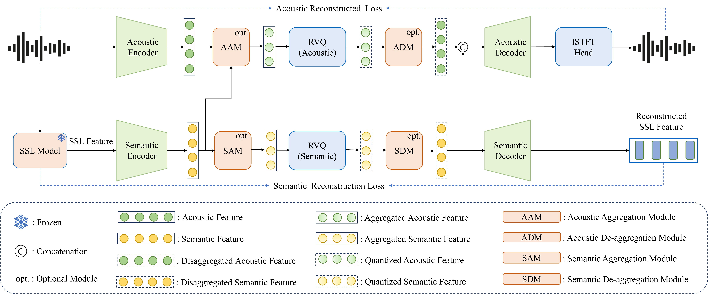

# QuarkAudio-HCodec: A Unified Discrete Audio Tokenizer for High-Fidelity, Multitask Audio Generation

<p align="center">
  <a href="https://arxiv.org/abs/2510.26372">
    
  </a>
  <a href="https://huggingface.co/spaces/QuarkAudio/">
    
  </a>
</p>

<p align="center">
  <a href="https://arxiv.org/abs/2510.26372"></a>
</p>

> 🔊 **H-Codec**: *A Unified, Dual-Stream Neural Audio Codec with Adaptive Frame Rate and 48kHz Support*  
> Enabling high-fidelity, efficient, and semantically rich audio tokenization for next-generation LLM-based audio generation.

🚀 **Key Highlights**:
- ✅ **Dual-Stream Tokenization**: Separately quantizes acoustic and semantic features into independent codebooks — preserving both signal fidelity and linguistic content.
- 🔄 **Dynamic Frame Rate (H-Codec-1.5)**: Introduces an adaptive temporal resolution mechanism built upon H-Codec-1.0, enabling variable frame rates based on content complexity.
- ⚙️ **Multi-Sampling Rate (H-Codec-2.0)**: Extends the sampling rate from **16kHz to 48kHz** under a fixed frame rate, significantly improving audio fidelity and high-frequency detail preservation.
- 🌍 **Unified Foundation**: Designed as a core component for multimodal LLMs, supporting diverse downstream tasks: TTS, VC, Editing, TTA, SE, and more.

📄 **Paper**: [arXiv:2510.26372](https://arxiv.org/abs/2510.26372) | 🎤 **Listen**: [Demo Page](https://hyyan2k.github.io/UniSE/) | 🤗 **Model**: [Hugging Face Spaces](https://huggingface.co/spaces/QuarkAudio/)

---

## 📦 Overview

This project introduces **H-Codec**, a unified discrete audio tokenizer that integrates self-supervised learning (SSL) representations into the codec architecture to enable **dual-stream (acoustic + semantic) tokenization**. Unlike prior work that fuses modalities before quantization (e.g., X-Codec), H-Codec employs **separate codebooks** for acoustic and semantic streams, allowing independent optimization and better reconstruction quality.

We extend the original H-Codec (*aka* H-Codec-1.0) in *UniTok-Audio (Liu et al., 2025)* into two advanced variants:

| Version       | Key Feature                     | Sampling Rate | Frame Rate     |
|---------------|----------------------------------|---------------|----------------|
| **H-Codec-1.0** | Dual-stream quantization          | 16 kHz        | Fixed          |
| **H-Codec-1.5** | Dynamic frame rate adaptation     | 16 kHz        | Adaptive       |
| **H-Codec-2.0** | Full-bandwidth 48kHz support      | 48 kHz        | Fixed          |

These improvements significantly enhance **audio fidelity**, **temporal efficiency**, and **applicability** across speech, music, and general audio.

🔧 **Architecture Core Components**:
1. **Encoder**: Extracts continuous representations from waveform and SSL model (e.g., WavLM).
2. **Quantizer Module**: Two independent codebooks — one for acoustic details, one for semantic meaning.
3. **Decoder**: Reconstructs high-quality audio from discrete token sequences.

💡 H-Codec is designed as a foundational module for **LLM-based audio generation**, seamlessly integrating with autoregressive language models for end-to-end training and inference.

<!-- ---

## 🧰 Installation

### Option 1: Using pip

```bash
pip install -r requirements.txt -->


## Installation
1. Install dependencies from requirement.txt via pypi or environment.yml via anaconda
2. Feel free to download our pretrained model from [gdrive]() to <project_root>/checkpoints/hcodec_adaptive.ckpt

## Tokenizer
+ Quick start

```bash
#!/bin/bash
python audio_tokenizer.py
```
