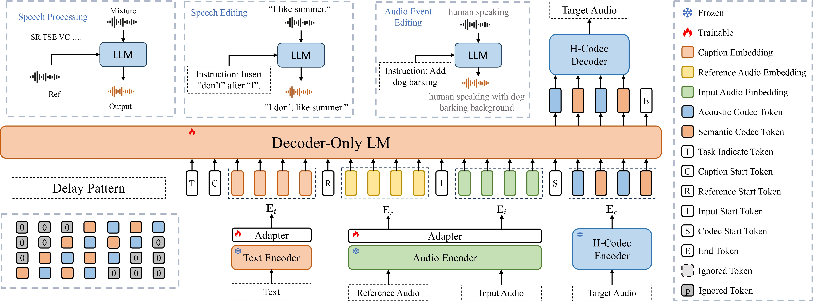

# QuarkAudio: An Open-Source Project to Unify Audio Processing and Generation

  
  
  
  
  

  

## Introduction
This project contains a series of works developed for audio (including speech, music, and general audio events) processing and generation, which helps reproducible research in the field of audio. The target of **QuarkAudio** is to explore a unified framework to handle **different audio processing and generation tasks**, including:

🚀 **Key Highlights**:
- ✅ **Unified & Prompt-Free**: Handles multiple tasks without explicit instruction.
- ⚙️ **Decoder-only AR-LM Backbone**: Leverages LLM-style autoregressive generation for speech token prediction.
- 🔄 **End-to-End Compatible**: Integrates WavLM/Hubert (feature extractor), H-Codec (discrete codec), and LM into one pipeline.
- 🌍 **Multitask Support**: SE, SR, TSE, SS, EDIT, VC, LASS, TTA, and more — all in a single model.

📄 **Paper**: [arXiv:2510.20441](https://arxiv.org/pdf/2512.20151) | 🎤 **Listen**: [Demo Page](https://hyyan2k.github.io/UniSE/) | 🤗 **Model**: [Hugging Face Spaces](https://huggingface.co/spaces/QuarkAudio/)

## 📋 Supported Tasks

| Task | Full Name | Status | Description |
|------|-----------|--------|-------------|
| **SR** | Speech Restoration | ⛳ supported | Recover clean speech from corrupted inputs (e.g., noise, reverb, packet loss) |
| **TSE** | Target Speaker Extraction | ⛳ supported | Extract target speaker using reference enrollment audio |
| **SS** | Speech Separation | ⛳ supported | Separate mixed speakers or sound sources |
| **VC** | Voice Conversion | ⛳ supported | Convert the speaker identity of input speech while preserving linguistic content |
| **LASS** | Language-Queried Audio Source Separatio | ⛳ supported | Separate sound sources based on natural language queries (e.g., "remove the man's voice") |
| **CODEC** | Audio Tokenization  | ⛳ supported | Encode speech into compact discrete tokens and reconstruct high-fidelity audio via decoding |
| **AE** | Audio Editing  | ⛳ supported | Edit spoken content by inserting, deleting, or substituting words/phrases in the audio domain |
| **TTA** | Text to Audio  |⏳ Developing | Generate speech or environmental sounds directly from text prompts (upcoming in next release) |
| **AEC** | Acoustic Echo Cancellation | ⏳ Developing | Remove echo artifacts in teleconferencing scenarios (upcoming in next release) |
- more...

In addition to the frameworks for specific audio tasks, **QuarkAudio** also provides works involving **neural audio codec (NAC)**, which is the fundamental module to combine audio modality with language models.

## 🚀 News
- **2025/12/24**: We release [***QuarkAudio***](https://github.com/alibaba/unified-audio), an Open-Source Project to Unify Audio Processing and Generation.. 
- **2025/09/22**: We release [***UniSE***](https://github.com/hyyan2k/UniSE), a foundation model for unified speech generation. The system supports target speaker extraction, universal speech enhancement.[***demo***](https://hyyan2k.github.io/UniSE/), ,Code will comming soon. 
- **2025/10/26**: We release [***UniTok-Audio***](https://github.com/alibaba/unified-audio), The system supports target speaker extraction, universal speech enhancement, Speech Restoration, Voice Conversion, Language-Queried Audio Source Separation, Audio Tokenization,[***demo***](https://alibaba.github.io/unified-audio/), 
## key Works
### UniSE
[UniSE](https://github.com/alibaba/unified-audio/tree/main/QuarkAudio-UniSE): A Unified Framework for Decoder-Only Autoregressive LM-Based Speech Enhancement 
supported tasks: **SR**, **TSE**, **SS**
    