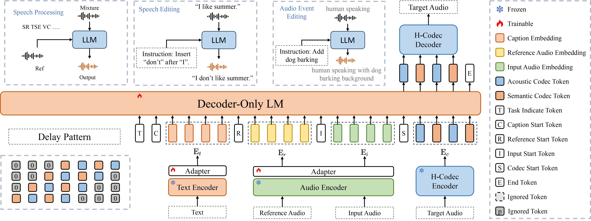

# QuarkAudio: An Open-Source Project to Unify Audio Processing and Generation

<p align="center">
  <a href="https://arxiv.org/pdf/2512.20151">
    
  </a>
  <a href="https://alibaba.github.io/unified-audio//">
    
  </a>
  <a href="https://huggingface.co/QuarkAudio/">
    
  </a>
  <a href="https://www.modelscope.cn/organization/QuarkAudio/">
    
</a>
  
</p>

<p align="center">
  <a href="https://arxiv.org/pdf/2512.20151"></a>
</p>

## Introduction
This project contains a series of works developed for audio (including speech, music, and general audio events) processing and generation, which helps reproducible research in the field of audio. The target of **QuarkAudio** is to explore a unified framework to handle **different audio processing and generation tasks**, including:

🚀 **Key Highlights**:
- ✅ **Unified & Prompt-Free**: Handles multiple tasks without explicit instruction.
- ⚙️ **Decoder-only AR-LM Backbone**: Leverages LLM-style autoregressive generation for speech token prediction.
- 🔄 **End-to-End Compatible**: Integrates WavLM/Hubert (feature extractor), H-Codec (discrete codec), and LM into one pipeline.
- 🌍 **Multitask Support**: SE, SR, TSE, SS, EDIT, VC, LASS, TTA, and more — all in a single model.

📄 **Paper**: [arXiv:2510.20441](https://arxiv.org/pdf/2512.20151) | 🎤 **Listen**: [Demo Page](https://alibaba.github.io/unified-audio/) | 🤗 **Model**: [Hugging Face Spaces](https://huggingface.co/QuarkAudio/)

---
 Please leave your ⭐ on our GitHub to support this community project！

记得点击右上角的星星⭐来支持我们一下，您的支持是我们更新模型的最大动力！

## 📋 Supported Tasks

| Task | Full Name | Status | Description |
|------|-----------|--------|-------------|
| **SR** | Speech Restoration | ⛳ supported | Recover clean speech from corrupted inputs (e.g., noise, reverb, packet loss) |
| **TSE** | Target Speaker Extraction | ⛳ supported | Extract target speaker using reference enrollment audio |
| **SS** | Speech Separation | ⛳ supported | Separate mixed speakers or sound sources |
| **VC** | Voice Conversion | ⛳ supported | Convert the speaker identity of input speech while preserving linguistic content |
| **LASS** | Language-Queried Audio Source Separatio | ⛳ supported | Separate sound sources based on natural language queries (e.g., "remove the man's voice") |
| **CODEC** | Audio Tokenization  | ⛳ supported | Encode speech into compact discrete tokens and reconstruct high-fidelity audio via decoding |
| **AE** | Audio Editing  | ⛳ supported | Edit spoken content by inserting, deleting, or substituting words/phrases in the audio domain |
| **TTA** | Text to Audio  |⏳ Developing | Generate speech or environmental sounds directly from text prompts (upcoming in next release) |
| **AEC** | Acoustic Echo Cancellation | ⏳ Developing | Remove echo artifacts in teleconferencing scenarios (upcoming in next release) |
- more...

In addition to the frameworks for specific audio tasks, **QuarkAudio** also provides works involving **neural audio codec (NAC)**, which is the fundamental module to combine audio modality with language models.


## 🚀 News
- **2026/01/29**: 🎉 Our paper ["A Hybrid Discriminative and Generative System for Universal Speech Enhancement"](http://arxiv.org/abs/2601.19113) has been accepted to **ICASSP 2026**! Built upon the **QuarkAudio** like architecture, this hybrid system achieved **3rd place** in the **URGENT 2026 Challenge (Track 1)**. [](http://arxiv.org/abs/2601.19113)
- **2025/12/24**: We release ***QuarkAudio***, an Open-Source Project to Unify Audio Processing and Generation.[](https://arxiv.org/pdf/2512.20151). The code is publicly available at: [QuarkAudio-HCodec](https://github.com/alibaba/unified-audio/tree/main/QuarkAudio-HCodec), along with pretrained models and inference examples.
- **2025/10/26**: We release ***UniTok-Audio***, The system supports target speaker extraction, universal speech enhancement, Speech Restoration, Voice Conversion, Language-Queried Audio Source Separation, Audio Tokenization,[***demo***](https://alibaba.github.io/unified-audio/), [](https://arxiv.org/abs/2510.26372). Code will comming soon.
- **2025/09/22**: We release ***UniSE***, a foundation model for unified speech generation. The system supports target speaker extraction, universal speech enhancement. [](https://arxiv.org/abs/2510.20441). The code is publicly available at: [UniSE](https://github.com/alibaba/unified-audio/tree/main/QuarkAudio-UniSE), along with pretrained models and inference examples.


## Citation
If you use this code or result in your paper, please cite our work as:
```tex
@misc{liu2025quarkaudiotechnicalreport,
      title={QuarkAudio Technical Report}, 
      author={Chengwei Liu and Haoyin Yan and Shaofei Xue and Xiaotao Liang and Xiaofu Chen and Bin Gong and Zheng Xue and Gang Song},
      year={2025},
      eprint={2512.20151},
      archivePrefix={arXiv},
      primaryClass={eess.AS},
      url={https://arxiv.org/abs/2512.20151}, 
}
```

## License
<!-- TODO: check and add license -->
QuarkAudio is released under the Apache 2.0 license.

## Star History
[](https://www.star-history.com/#alibaba/unified-audio&type=date&legend=top-left)
